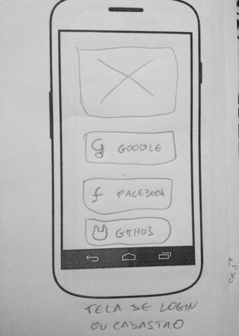
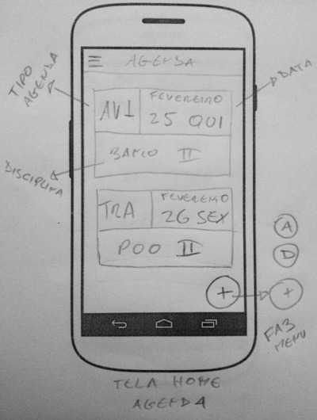
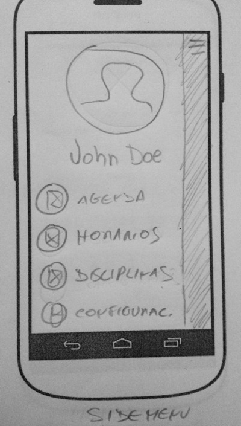
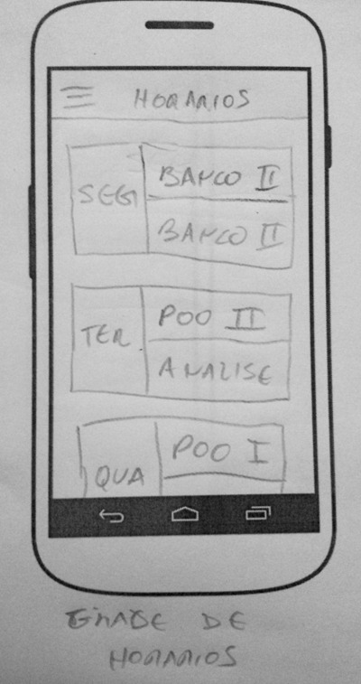
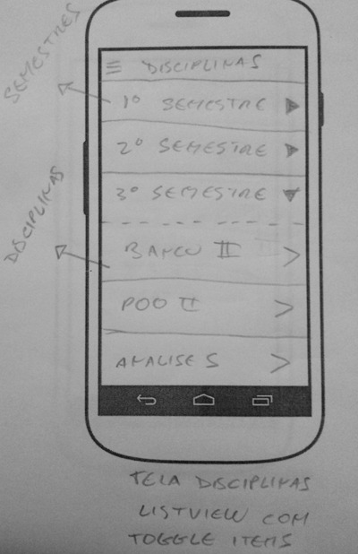
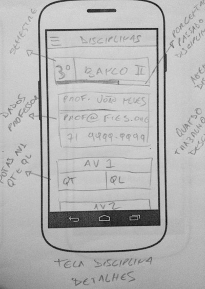
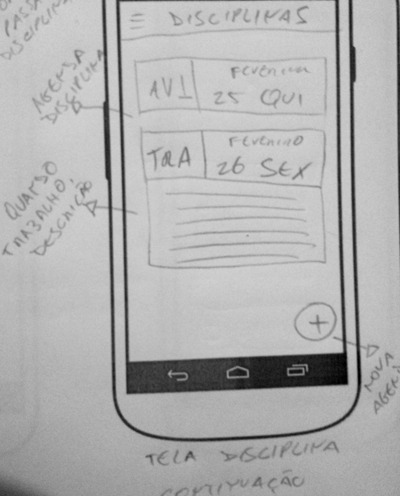
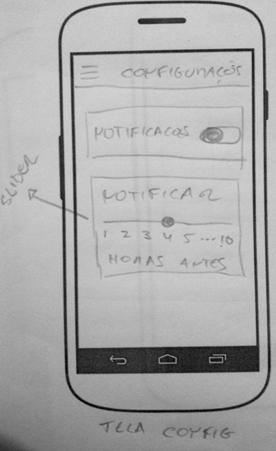
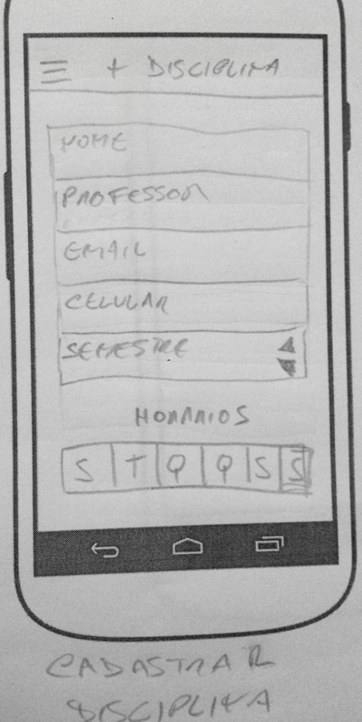
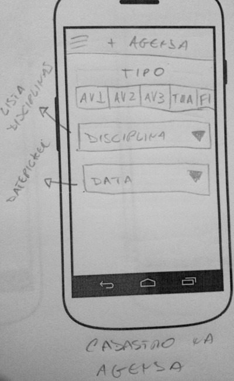

Agenda Acadêmica CIMATEC
===================

Este projeto tem como objetivo desenvolver um aplicativo híbrido onde os alunos da rede SENAI (Não somente os alunos CIMATEC) possam gerenciar de maneira rápida e fácil suas matérias, notas e agenda de provas e trabalhos de cada semestre.

----------

Requisitos
-------------

Para atingir este propósito, o aplicativo deve ter as seguintes funcionalidades:

> - Permitir o cadastro de usuário através da integração de login com os serviços Google, Facebook e Github.
> - Permitir o cadastro e gerenciamento de disciplinas, onde cada disciplina deve conter: *Nome da Disciplina, Nome do Professor, E-mail do Professor, Celular do Professor, Horários da Disciplina e Notas da Disciplina*.
> - Exibir o progresso na disciplina, no que se refere às notas, fazendo o cálculo de média adotado pelo SENAI.
> - Permitir o agendamento de atividades que devem ser classificadas como AV1, AV2, AV3, Fin (prova final) e Tra (trabalho).
> - Permitir notificar o usuário sobre a ocorrência da atividade agendada com antecedência.
> - Manter os dados locais para acesso rápido e offline.
> - Manter um backup online dos dados registrados no aplicativo para posterior resgate.

Tecnologias Escolhidas
-------

Para o desenvolvimento do projeto foram definidas as seguintes tecnologias.

##### Para o desenvolvimento do aplicativo
> - [Ionic Framework](http://ionicframework.com) - Framework mobile híbrido.
> - [Lovefield](https://google.github.io/lovefield) - Para persistência de dados local utilizando IdexedDB.
> - [Ionic Material](https://github.com/zachsoft/Ionic-Material) - Framework CSS para Material Design

##### Para o desenvolvimento do servidor (backup dos dados)
> - [Node.JS](https://nodejs.org/en) - Para servidor de aplicação.
> - [MongoDB](https://www.mongodb.org) - Para persistência de dados.
> - [Mongoose](http://mongoosejs.com) - Framework de persistência
> - [Express.js](http://expressjs.com) - Framework MVC, MVVC
> - [API REST](https://pt.wikipedia.org/wiki/REST) - Como padrão de webservice 

Protótipos de Tela Iniciais
----------------

Estes são os conceitos iniciais do aplicativo.
Tela Login e Cadastro | Tela Agenda de Atividades | Sidebar
 --- | --- | ---
  |  | 

Tela Horários de Aula | Tela Lista de Disciplinas
--- | ---
 | 

Tela Disciplina Detalhes | Tela Disciplina Detalhes
--- | ---
 | 

Tela Configurações | Tela Cadastro de Disciplina | Tela Cadastro de Atividade
--- | --- | ---
 |  | 
